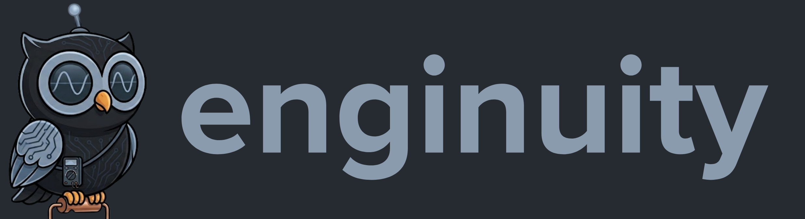
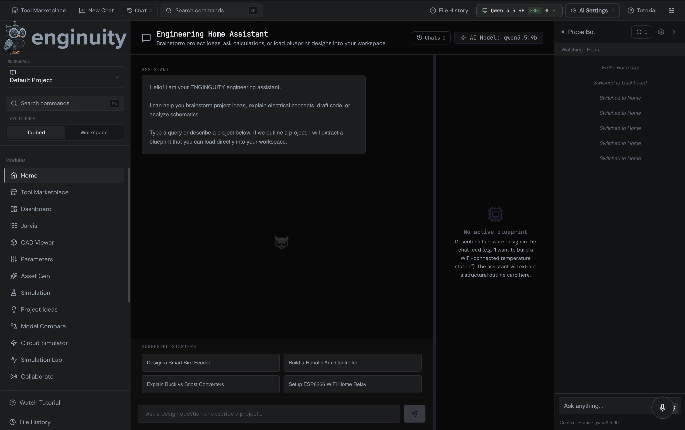
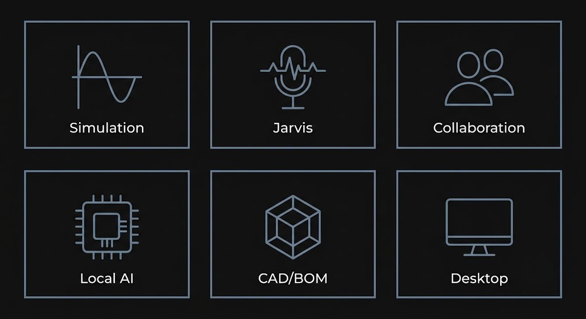
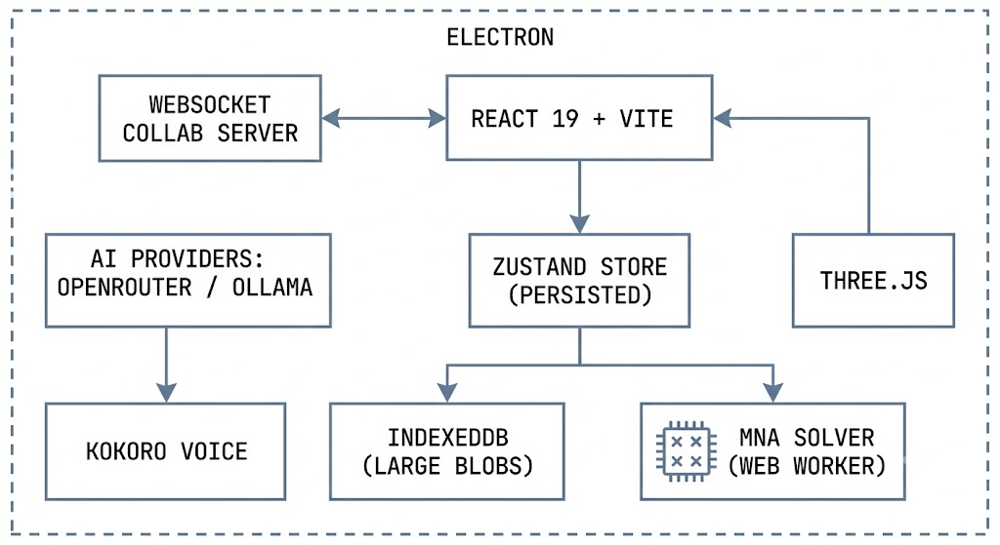
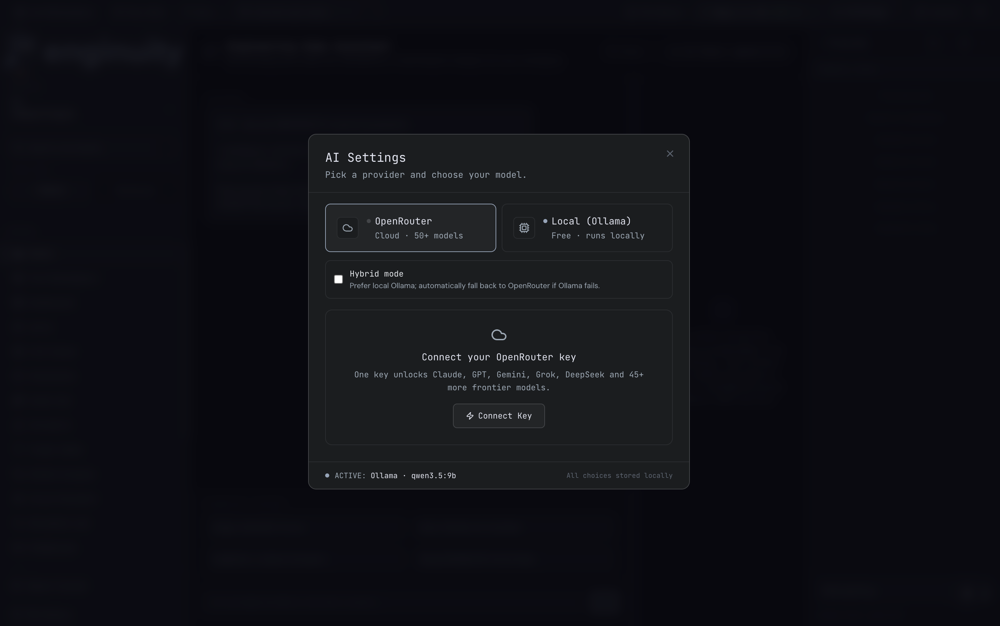
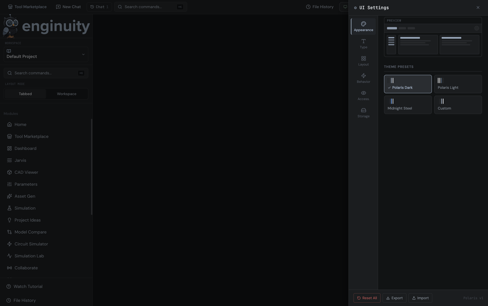
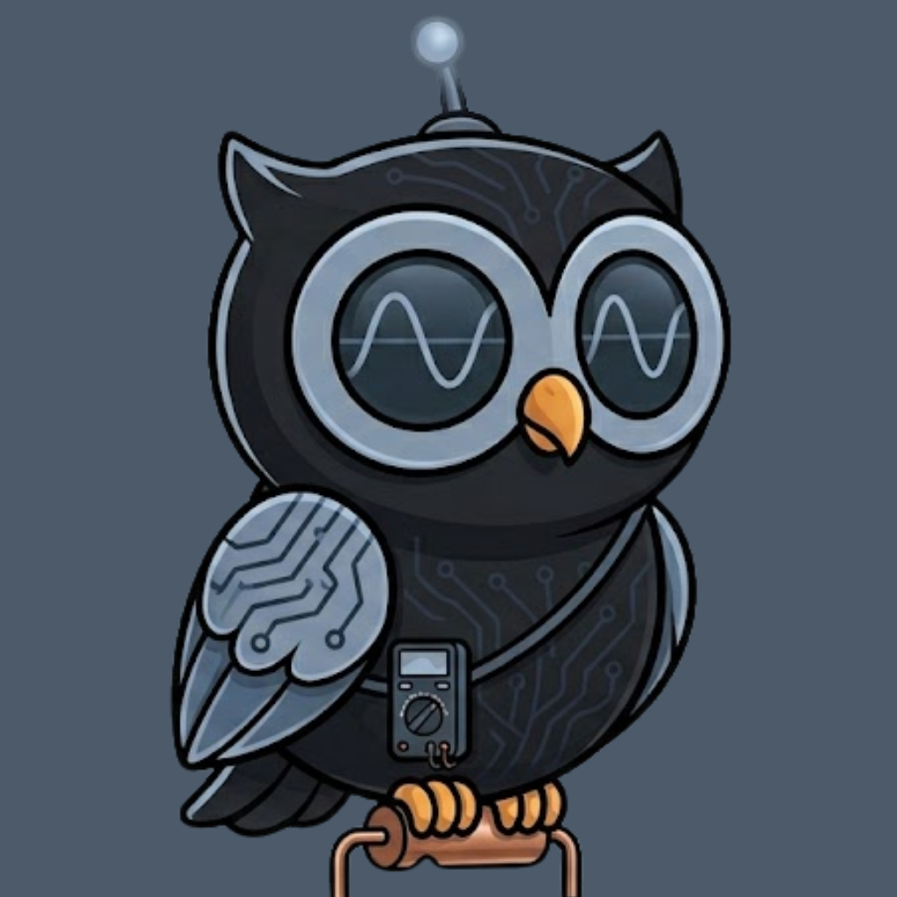

# ENGINGUITY

[](https://github.com/ara-mkr/Enginuity/actions/workflows/ci.yml)
[](LICENSE)
[](package.json)
[](electron-builder.yml)

**An AI-powered engineering workspace for engineers and makers.** Web app + Electron desktop. Circuit simulation, CAD viewing, firmware diffing, BOM intelligence, collaboration, and voice — one workspace, one keyboard away.

> ⚠️ **Work in progress.** ENGINGUITY is under active solo development by a
> single builder. The core loops work; some corners are half-wired; some
> features are behind a flag or not yet reachable from the UI. The
> **Known Limitations** section below is honest about what isn't done yet.
> If you clone this and something breaks, it's not you — it's this note
> being accurate. PRs and issues welcome.



---

## What ENGINGUITY does

- **Circuit simulation.** Draw a circuit in the visual Simulation tab, or describe one in plain English and let the Simulation Assistant draft the SPICE netlist — either way, a deterministic in-house MNA solver runs the math (DC operating point, DC sweep, transient, AC; diodes, BJTs, MOSFETs, op-amps, the 555). **AI never touches the numbers.**
- **Jarvis voice.** A voice-controlled infinite canvas. Neural speech via Kokoro-82M running fully in-browser (ONNX/WASM — no cloud TTS, no audio leaves your machine), with automatic fallback to the browser's Web Speech API.
- **Collaboration.** Real-time multi-user sessions over a hardened WebSocket server: per-room tokens with timing-safe comparison, prototype-pollution guards, message size caps, per-connection rate limits.
- **Local or cloud AI.** Bring your own OpenRouter key (entered in-app, kept in sessionStorage — never in the bundle or on disk), or run everything locally through Ollama. A "both" mode prefers local and falls back to cloud.
- **The rest of the bench.** CAD viewer (STL/OBJ/3MF via Three.js), BOM intelligence, PCB review, firmware diff, datasheet library, engineering notebook, formula lab, and more — all AI-assisted, all in one shell.
- **Polaris design system.** Near-black palette, steel-blue (`#94a5ba`) accents, Ohma the owl.



---

## Architecture at a glance



- **Frontend:** React 19, TypeScript, Vite, Tailwind CSS
- **State:** Zustand with `persist` middleware; large payloads offloaded to IndexedDB via `idb`
- **3D:** Three.js
- **AI:** OpenRouter (cloud) and/or Ollama (local), switchable in-app; native Ollama token metrics on the dashboard
- **Voice:** Kokoro-82M (`onnx-community/Kokoro-82M-v1.0-ONNX`, quantized, WASM) running entirely in-browser; Web Speech API fallback
- **Simulation:** Deterministic in-house MNA solver in a Web Worker. **The AI never performs numerical computation.** Circuit math is owned by the solver, always. (An optional Velxio simulator embed is also available as a separate iframe-hosted tool — see `docs/integrations/velxio.md`.)
- **Collaboration:** Hardened WebSocket server (`collaboration-server.js`) — per-room tokens, timing-safe comparison, prototype-pollution guards, 64 KB message cap enforced before parse, rate limits
- **Desktop:** Electron with `contextIsolation` on, `nodeIntegration` off, and a narrow validated IPC surface

---

## Getting started

Requires Node 20+.

```bash
git clone https://github.com/ara-mkr/Enginuity.git
cd Enginuity
npm install
npm run dev
```

<!-- IMAGE: getting-started terminal — one screenshot of the four commands above running through to the Vite dev-server URL, dark terminal theme. -->

For the Electron desktop app:

```bash
npm run electron:dev     # dev
npm run electron:build   # packaged build (unsigned — see Known Limitations)
```

For collaboration, run the WebSocket server in a second terminal:

```bash
npm run collab           # starts collaboration-server.js on :3001
```

For the optional Velxio circuit-simulator embed with Docker:

```bash
npm run dev:all          # Velxio container + Vite together
```

---

## Configuration

Everything is optional. **AI keys are not configured in `.env`** — enter your OpenRouter key in-app (Settings → Connect AI); it is kept in sessionStorage only, never written to disk or bundled. The Ollama host is also set in-app.

Copy `.env.example` to `.env` to configure the rest:

```
# Collaboration server (use wss:// behind TLS in production)
VITE_COLLAB_WS_URL=ws://localhost:3001

# Velxio simulator embed (optional; see .env.example for all knobs)
VITE_VELXIO_URL=http://localhost:3080
```

If no AI provider is connected, AI features are inert and prompt you to connect one — the solver, visual editor, and every non-AI tool keep working. With Ollama selected and the server down, "both" mode falls back to OpenRouter; with neither reachable you get an explicit error, not a hang.



---

## Known Limitations

**This section is deliberately honest.** ENGINGUITY is pre-1.0 and built by
one person. It is generated from the pre-launch audit (`AUDIT_REPORT.md`)
and will shrink as things get fixed.

- **Test Harness — Python path.** The JavaScript test runner is sandboxed and safe. The Python runner expects Pyodide to already be loaded, which the harness doesn't do on its own yet, so Python tests fail unless the Debug Console (which loads Pyodide) has been opened first. Fix in flight.
- **Type-safety debt.** The tree compiles in CI, but ~170 `@ts-ignore`/`any` escapes remain at the TypeScript/JSX seams. Being burned down module by module.
- **No Content-Security-Policy yet.** The renderer has no CSP header. It's a defense-in-depth hardening item, not a live exploit, and it's on the pre-1.0 list.
- **Unsigned desktop builds.** The packaged `.dmg`/`.exe` are unsigned; macOS Gatekeeper and Windows SmartScreen will warn. Build from source, or click through knowingly. No auto-updater yet.
- **Fonts need a network on first load.** UI fonts (DM Sans / JetBrains Mono) load from Google Fonts; fully-offline sessions fall back to system fonts. Self-hosting is planned.
- **Collaboration trust model.** The first client to join a room establishes its token. Use long, unguessable room IDs (the app generates them) and run the server behind TLS (`wss://`) in production. A `server/README.md` documenting this isn't written yet.
- **Jarvis + Drawing Board.** Opening the Drawing Board from inside Jarvis can occasionally render blank on first mount (suspected store-rehydration race — still being pinned down). Refresh recovers.
- **Open-source solver migration.** A migration to `eecircuit-engine` (ngspice-WASM, MIT) has passed its correctness spike but the adapter isn't landed; today's solver is the in-house MNA engine. Microcontroller co-simulation (avr8js Code Box) is designed but not reachable from the UI.
- **CAD** beyond viewing (STL/OBJ/3MF/DXF) is planned, not shipped.
- **Docs.** `server/README.md`, the contributor guide, and inline JSDoc are incomplete.

<!-- IMAGE (optional): a small Ohma illustration wearing a hard-hat holding an "under construction" sign, steel-blue, kept minimal (not cutesy). -->

---

## Design system: Polaris



<!-- IMAGE: Polaris tokens — one dark canvas showing the palette swatches (near-black backgrounds, steel-blue #94a5ba accent), the DM Sans + JetBrains Mono type samples, and a small three-pane layout diagram. -->

- Palette: near-black backgrounds, steel-blue (`#94a5ba`) accent, no saturated colors.
- Typography: DM Sans for UI, JetBrains Mono for code.
- No gradients, no glow effects.
- Three-pane layout: left sidebar navigation, center panel, right context panel.
- Mascot: Ohma the owl.



---

## AI integrity

ENGINGUITY treats large language models as language tools, not calculators.
Every number that matters — voltages, currents, timing, pin states — is
computed by the deterministic MNA engine. Netlists, explanations, and
component suggestions are the model's job. Simulation and code execution
are not. The solver path has deliberately no fallback: simulation numbers
only ever come from the solver.

This is a load-bearing design decision. If you contribute a code path
where the model is asked to compute a numerical answer, it will not be
merged.

---

## Contributing

See [CONTRIBUTING.md](CONTRIBUTING.md). The short version:

1. Open an issue before large PRs.
2. Keep changes Polaris-compliant.
3. Do not introduce runtime LLM calls for deterministic computation.
4. If you touch persisted state, make sure hydration is safe.

CI runs lint, `tsc -b`, and the build on every PR.

---

## License

[MIT](LICENSE). Third-party license notices are tracked in
[THIRD_PARTY_NOTICES.md](THIRD_PARTY_NOTICES.md); see `AUDIT_REPORT.md`
for the license status of evaluated simulator engines.

---

## Acknowledgments

- Ohma 🦉
- The ngspice, EEcircuit, and avr8js maintainers, whose work shapes the solver roadmap
- Everyone who has stress-tested the app and filed an issue

<!-- IMAGE: footer mark — a small, subtle steel-blue Ohma silhouette, centered. -->
